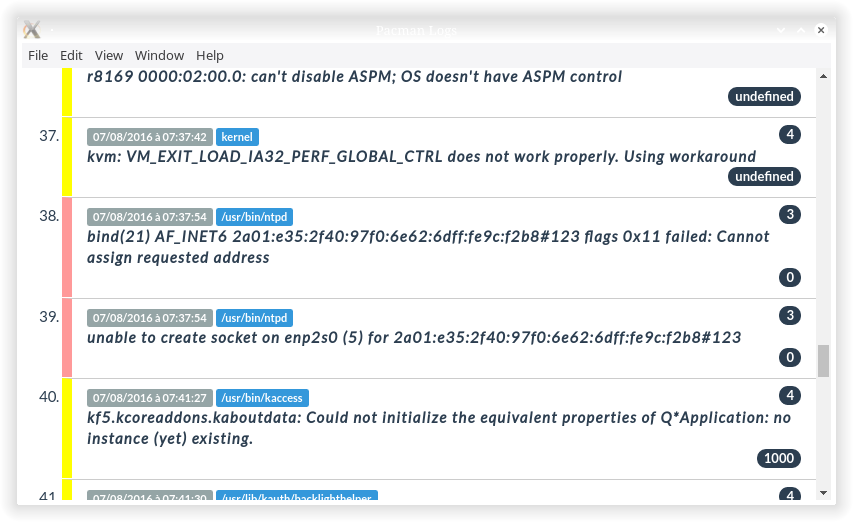

# sys-journald

**View systemd logs.**

## Functions

- view Logs, filters, details
- man search, view man in html with hyperlink 
between them
- system infos: partitions, boot, systemd units
- pacman : -Qi and -Ql
- themes



## To Use

To clone and run this repository you'll need [Git](https://git-scm.com) and [Node.js](https://nodejs.org/en/download/) (which comes with [npm](http://npmjs.com)) installed on your computer. From your command line:

```bash
# Clone this repository
git clone https://github.com/papajoker/sys-journald
# Go into the repository
cd sys-journald
# Install dependencies and run the app
npm install && npm start
```

This is a minimal Electron application based on the [Quick Start Guide](http://electron.atom.io/docs/latest/tutorial/quick-start).
Learn more about Electron and its API in the [documentation](http://electron.atom.io/docs/latest).

